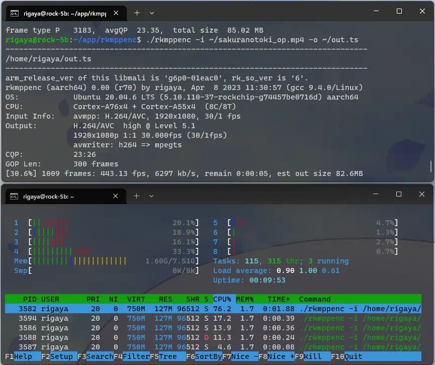

# rkmppenc  
by rigaya

[](https://github.com/rigaya/rkmppenc/actions/workflows/build_packages.yml)  

このソフトウェアは、Orange Pi、Nano Pi、Radxa ROCKシリーズ等のSBCに使用されているRockchip系SoC内蔵のHWエンコーダ(rkmpp)の画質や速度といった性能の実験を目的としています。  

例: 1080pのhwデコード→エンコード (ROCK 5B [RK3588 SoC])


## 配布場所 & 更新履歴
[こちら](https://github.com/rigaya/rkmppenc/releases)  

## rkmppenc 使用にあたっての注意事項
無保証です。自己責任で使用してください。  
rkmppencを使用したことによる、いかなる損害・トラブルについても責任を負いません。

## インストール
インストール方法は[こちら](./Install.ja.md)。

## ビルド
ビルド方法は[こちら](./Build.ja.md)。

## 想定動作環境

### Linux
Debian/Ubuntu系  
  そのほかのディストリビューションでも動作する可能性があります。

## rkmppencの使用方法とオプション  
[rkmppencのオプションの説明](./rkmppenc_Options.ja.md)


## 使用出来る主な機能
#### rkmppenc
- mppを使用したエンコード
   - H.264/AVC
   - HEVC
- mppの各エンコードモード
   - CQP       固定量子化量
   - VBR       可変ビットレート
   - CBR       固定ビットレート
- Level / Profileの指定
- 最大ビットレートの指定
- 最大GOP長の指定
- avs, vpy, y4m, rawなど各種形式に対応
- HWデコード
  - H.264
  - HEVC
  - MPEG2
  - VP9
  - AV1
- HW 2Dアクセラレータによるリサイズフィルタ(librga im2d API使用)
- HWインタレ解除フィルタ (mpp iep v2 API使用)
- OpenCLフィルタ
- ソースファイルからの音声抽出や音声エンコード
- mp4,mkv,tsなどの多彩なコンテナに映像・音声をmuxしながら出力

## Radxa ROCK 5B の HDMI In の活用

Radxa ROCK 5B (RK3588) HDMI In は、ffmpeg 6.0 時点ではサポートされない v4l2 multi-planar API を使用するとともに、いくつかのv4l2の呼び出しに応答しないため、通常ffmpegでキャプチャすることができません。

rkmppencでは、v4l2 multi-planar APIへの対応と、v4l2の呼び出し関連のエラー回避を行った[ffmpeg](https://github.com/rigaya/FFmpeg)を使用することで、HDMI Inのキャプチャに対応していて、下記のようにしてキャプチャすることができます。

```bash
# video settings
V4L2_DV_TIMINGS_IDX=19
v4l2-ctl --set-dv-bt-timings index=${V4L2_DV_TIMINGS_IDX}
# index from v4l2-ctl --list-dv-timings
# Rock 5B (RK3588) list
# 10 1920x1080 30fps
# 14 1920x1080 60fps
# 17 3840x2160 30fps
# 19 3840x2160 60fps

# auto select hdmiin auto
ALSA_DEVICE_ID=`arecord -l | grep rockchiphdmiin | sed -e 's/^card \([0-9]\+\).*/\1/g'`
echo ALSA_DEVICE_ID=${ALSA_DEVICE_ID}

# add --input-analyze and --input-probesize to minimize startup latency
rkmppenc --input-format v4l2 -i /dev/video0 \
  --input-analyze 0.2 --input-probesize 10000 \
  --input-option channel:0 --input-option ignore_input_error:1 --input-option ts:abs \
  --audio-source "hw:${ALSA_DEVICE_ID}:format=alsa/codec=aac;enc_prm=aac_coder=twoloop;bitrate=192" \
  -o out.ts
```

### 映像

映像の細かい設定を行うには、v4l2-ctlが必要です。

```bash
sudo apt install v4l-utils
```

#### 入力解像度の変更

まず、```v4l2-ctl --list-dv-timings```で対応している解像度/fpsと、対応するindexを確認します。そして、そのindexの値で、```v4l2-ctl --set-dv-bt-timings index=<n>```を実行すると解像度を変更できます。その後、rkmppencを実行すると指定の解像度で読み込むことができます。


### 音声

 ```--audio-source```に指定するデバイスIDは```arecord -l```で確認することができます。
 
なお、alsaによる音声読み込みを行うには、"audio" groupへの所属が必要です。

```bash
sudo gpasswd -a `id -u -n` audio
```

## ソースコードについて
- MITライセンスです。
- 本ソフトウェアでは、
  [mpp](https://github.com/rockchip-linux/mpp),
  [librga](https://github.com/airockchip/librga),
  [ffmpeg](https://ffmpeg.org/),
  [libplacebo](https://code.videolan.org/videolan/libplacebo),
  [libhdr10plus](https://github.com/quietvoid/hdr10plus_tool),
  [libdovi](https://github.com/quietvoid/dovi_tool),
  [tinyxml2](http://www.grinninglizard.com/tinyxml2/),
  [dtl](https://github.com/cubicdaiya/dtl),
  [clRNG](https://github.com/clMathLibraries/clRNG),
  [ttmath](http://www.ttmath.org/),
  [Caption2Ass](https://github.com/maki-rxrz/Caption2Ass_PCR)を使用しています。  
  これらのライセンスにつきましては、該当ソースのヘッダ部分や、rkmppenc_license.txtをご覧ください。

### ソース概要
文字コード: UTF-8-BOM  
改行: CRLF  
インデント: 半角空白x4
